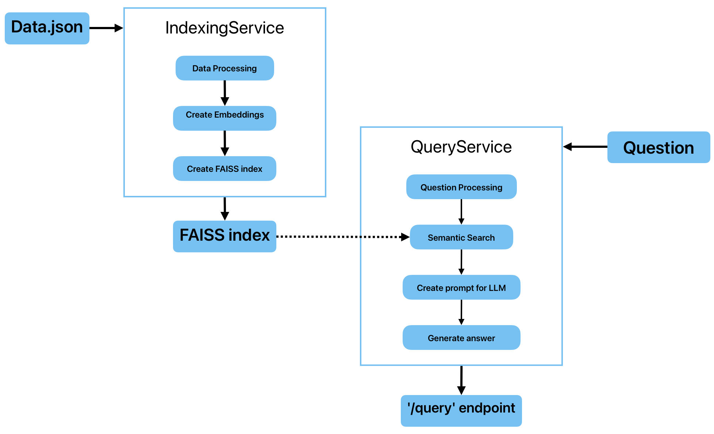

<h1 align="center">Q&A сервис с использованием RAG </h1>
<div align="center" style="margin: 20px 0;">
  
  
  
  
  
  
</div>

<br>

Прототип сервиса вопрос-ответ (Q&A) на основе RAG архитектуры, с возможностью тестирования. 

Система:

* Принимает текстовый вопрос пользователя.

* Находит наиболее релевантные фрагменты информации из предоставленного набора документов (knowledge base).

* Использует LLM для генерации полного, информативного ответа на основе найденных фрагментов.

* Реализована как набор взаимодействующих микросервисов/компонентов, готовых к контейнеризации и развертыванию.

* Имеет потенциал для горизонтального масштабирования.


Система протестирована и полностью готова к использованию.
Используется датасет русских текстов [RuBQ_2.0](https://raw.githubusercontent.com/vladislavneon/RuBQ/refs/heads/master/RuBQ_2.0/RuBQ_2.0_paragraphs.json).

# 📃 Краткое описание сервисов:
**Сервис индексирования** -
принимает путь к данным для обработки, создает векторную БД (`FAISS`). Поддерживается инкрементальное обновление.

Пайплайн:
* Загрузка данных
* Проверка качества
* Очистка и нормализация
* Разбиение длинных текстов на чанки
* Векторизация
* Сохранение в векторную БД

**Сервис запросов** -
предоставляет API (`FastApi`) для приема запросов (`/query`) с использованием `LangChain`. В качестве LLM - `llama3`, запущенная локально. 

Пайплайн:
* Препроцессинг вопроса
* Поиск ревелантных чанков в векторной БД
* Формирование промпта для LLM
* Запрос к LLM
* Возврат сгенерированного ответа

# 🛠️ Схема взаимодействия компонентов


# ▶️ Установка
1. Клонирование репозитория
```
git clone https://github.com/zolotykh907/RAG.git
cd RAG
python3 -m venv .venv && source .venv/bin/activate
```
2. Установка зависимостей

Для индексации:
```
pip install -r indexing/requirements.txt
```

Для запросов:
```
pip install -r query/requirements.txt
```

# 🚀 Запуск
Систему можно запустить локально, и с использованием `Docker`.

**💻 Локально:**

Для начала нужно установить Ollama для запуска llama3 локально:
```
ollama pull llama3
```
В терминале запустите сервер Ollama, и не закрывайте его:
```
ollama serve
```
1. Индексация
```
python indexing/run_indexing.py
```

2. Запросы (API)
```
uvicorn query.app:app --host 0.0.0.0 --port 8000
```

**🐳 С использованием Docker**
```
docker-compose up --build
```

После этого вы сможете обратиться к сервису запросов по адресу:
```
http://localhost:8000/query
```


Можно протестировать, запустив `client.py` и введя запрос.

# 🖥️ Использованные технологии

## LLM - `llama3`
Данная модель выдает качественные ответы на русском языке при небольшом весе (доступно много вариантов с различным кол-вом параметров), хорошо оптимизирована и легко устанавливается. 
Так же ее можно использовать в коммерческих целях и она абсолютна бесплатна.

## Модель для эмбеддингов - `sentence-transformers/paraphrase-multilingual-MiniLM-L12-v2`
Эффективно работает с множеством языков, в том числе русским.
Имеет небольшой размер (~500мб), при хорошем качестве работы.

## Векторная БД - `FAISS`
Оптимизирована для быстрого поиска похожих векторов разными способами, легко развернуть локально.
Работает с большими наборами данных.

## Фреймворк для работы с LLM - `LangChain`
Поддерживает универсальный интерфейс для работы с разными LLM, стандартизированные промты. Так же есть отличная система интеграции с внешними инструментами.

## Общие преимущества
* Полностью локальное бесплатное решение, которое не зависит внешних ресурсов (облачных моделей и т.д.)

* Есть возможность простой настройки через конфигурационные файлы

* Поддерживается русский язык

* Простое развертывание разными способами

* Есть возможность масштабирования


# 🔌 Описание API эндпоинта

## /query
Предоставляет сгенерированный ответ на основе поиска и и ответа модели

**📥 Формат запроса:**
```
{
  "question": "Кто такой Юрий Гагарин?"
}
```

**📤 Формат ответа:**
```
{
  "answer": "...",
  "texts": [
    {
      ...
    },
    ...
  ]
}
```

# 📊 Анализ и проверка данных

**Датасет [RuBQ_2.0](https://raw.githubusercontent.com/vladislavneon/RuBQ/refs/heads/master/RuBQ_2.0/RuBQ_2.0_paragraphs.json):**

Всего текстов: `56952`

Средняя длина текста: `449` символов

Мин. длина текста: `1` символов

Макс. длина текста: `11010` символов

**После проверки качества получили следующие значения:**

Пустых документов: `0`

Дубликатов по UID: `0`

Дубликатов по хэшу текстов: `179`, тексты сравнивались по хешу `SHA-256`

Коротких текстов (len<10): `93`

Кол-во текстов после очистки: `56719`


# ✅ Тесты и их запуск
Реализовано покрытие unit-тестами ключевых компонентов:

## test_data_quality (функции препроцессинга текста): 
Тестируются:
1. Нормализация текста:
* Приведение к нижнему регистру
* Удаление пунктуации и лишних пробелов
* Лемматизация слов

2. Вычисление хеша текста:
* Консистентность для одинаковых текстов с разным форматированием
* Уникальность хешей для разных текстов

3. Проверка качества данных:
* Выявление пустых документов
* Поиск дубликатов текстов
* Обнаружение слишком коротких текстов


## test_create_prompt (логика формирования промпта на основе вопроса и релевантных чанков):
Тестируются:
1. Формирование промпта:
* Корректная подстановка вопроса и контекста
* Соответствие заданному шаблону
2. Вызов LLM:
* Передача правильно сформированного запроса
* Обработка возвращаемого значения
3. Формат ответа:
* Проверка типа возвращаемых данных
* Валидация содержимого ответа

Используется MagicMock для изоляции теста от реальной LLM

DummyConfig содержит тестовый шаблон промпта

## test_integration (интеграционный тест, проверяющий работу всего пайплайна Q&A после запуска `docker-compose up` (отправка тестового вопроса через API и проверка наличия ответа)).
Тестируется:
1. Доступность API эндпоинта /query
2. Корректность обработки POST-запроса с вопросом
3. Структура и содержание возвращаемого ответа

Проверяет работу всей системы после запуска контейнера.

**Запуск всех тестов**:
```
pytest tests/
```

# 📈 Возможные улучшения и масштабирование
1. Улучшение поиска и создания эмбеддингов
* Использование более мощных моделей или моделей, специально обученных на русский язык

2. Улучшение LLM
* Использование более мощных локальных моделей или дообучение на собственных данных
* Доп. обраобтка наиболее часто задаваемых вопросов

3. Оптимизация 
* Квантование моделей
* Оптимизация под GPU/TPU
* Разделение запросов на батчи

4. Добавление сторонних инструментов и расширение функционала
* Создание ИИ-Агента, например с помощью LangChain
* Возможность работы не только с текстами (изображения, документы, таблицы)

5. Масштабирование
* Запуск нескольких реплик сервиса за балансировщиком нагрузки

# ✉️ Контакты

<div align="center">
  <a href="mailto:i.zolotykh@g.nsu.ru">
    
  </a>
  <a href="https://t.me/igor_zolotykh">
    
  </a>
</div>