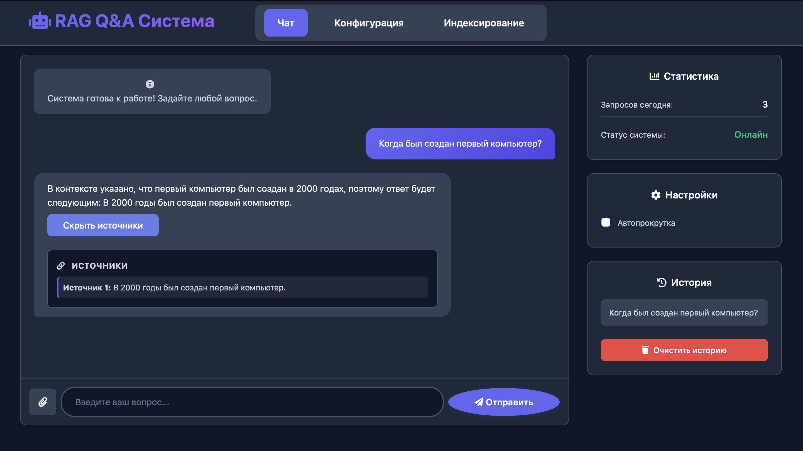

<h1 align="center">Q&A сервис с использованием RAG</h1>

<p align="center">
  
  
  
  
  
  
  
  
  
</p>

> Проект находится в разработке.

## О проекте

Система реализует RAG-пайплайн для работы с пользовательскими документами:

1. пользователь загружает документы в базу знаний;
2. сервис индексирования извлекает текст, очищает его и делит на фрагменты;
3. фрагменты векторизуются и сохраняются в FAISS;
4. пользователь задает вопрос;
5. сервис запросов находит релевантные фрагменты, переранжирует их и передает в LLM;
6. LLM формирует ответ на основе найденного контекста.

Основной сценарий - локальный запуск с LM Studio или другим OpenAI-compatible endpoint. При первой подготовке окружения модели Hugging Face и демонстрационные данные могут скачиваться из внешних источников, если их еще нет в локальном кэше.

В качестве демонстрационного корпуса используется датасет русских текстов [RuBQ 2.0](https://raw.githubusercontent.com/vladislavneon/RuBQ/refs/heads/master/RuBQ_2.0/RuBQ_2.0_paragraphs.json).

## Основной функционал

- текстовые вопросы по загруженным документам;
- постоянная база знаний;
- временные файлы внутри отдельной chat session;
- OCR для PDF и изображений в сервисе индексирования;
- инкрементальное обновление по SHA-256 хэшам фрагментов;
- атомарная публикация FAISS snapshot через `current_index.json`;
- reranking найденных фрагментов;
- кэширование повторных RAG-ответов в Redis;
- React web UI;
- опциональный desktop-режим через Tauri;
- Docker Compose запуск в микросервисной архитектуре.

## Архитектура

Основная микросервисная схема:

- `gateway` - Nginx, раздает React-интерфейс и маршрутизирует API-запросы;
- `indexing` - принимает документы, извлекает текст, строит embeddings и публикует FAISS snapshot;
- `query` - обрабатывает вопросы, читает текущий snapshot индекса, вызывает reranker, LLM и Redis cache;
- `redis` - хранит кэш ответов;
- `shared_data` - общий Docker volume с `current_index.json`, `index_snapshots` и обработанными данными.

Временные файлы сессий сейчас хранятся в памяти процесса query-сервиса, а не в Redis.

## Структура проекта

```text
rag_system/
  api/                 # монолитный API для локальной отладки и совместимости
  indexing/            # логика индексирования документов
  query/               # поиск, RAG-пайплайн, LLM, Redis, combined query
  services/
    gateway/           # Nginx gateway и сборка frontend
    indexing/          # микросервис индексирования
    query/             # микросервис запросов
  shared/              # FAISS, OCR, загрузка данных, конфиги, snapshots, temp storage

react_frontend/        # React frontend и Tauri shell
docker/                # Dockerfile для монолитного запуска
tests/                 # тесты
scripts/               # вспомогательные скрипты
data/                  # локальные данные и индекс
logs/                  # логи
```

## Веб-интерфейс



Интерфейс включает:

- чат с вопросами и ответами;
- загрузку временных файлов в текущую сессию;
- страницу документов;
- просмотр фрагментов документа;
- страницу настроек;
- отображение источников ответа.

Для desktop-режима используется Tauri:

```bash
cd react_frontend
npm run tauri:dev
```

## Используемые модели

- LLM: `qwen/qwen3-4b-2507`, запускается локально через LM Studio или совместимый OpenAI endpoint.
- Эмбеддинги: `intfloat/multilingual-e5-base`.
- Переранжирование: `BAAI/bge-reranker-v2-m3`.
- Векторный индекс: FAISS `IndexHNSWFlat`.

Для выбора модели эмбеддингов использовался RuBQ 2.0. После очистки корпуса осталось 56 719 текстов. По результатам сравнения `intfloat/multilingual-e5-base` дала лучший баланс качества поиска и скорости.

## Требования

- Python 3.10+;
- `uv`;
- Docker и Docker Compose;
- Node.js 18+ и npm;
- LM Studio или другой OpenAI-compatible LLM endpoint;
- Tesseract OCR и Poppler для локальной обработки PDF и изображений без Docker.

## Установка

```bash
git clone https://github.com/zolotykh907/RAG.git
cd RAG
```

Установка Python-зависимостей:

```bash
uv sync
```

Установка frontend-зависимостей:

```bash
cd react_frontend
npm install
```

## Запуск через Docker

Перед запуском нужно поднять LM Studio:

1. скачайте и установите LM Studio;
2. загрузите модель `qwen/qwen3-4b-2507` или измените модель в `rag_system/query/config.yaml`;
3. включите OpenAI-compatible local server на порту `1234`;
4. не закрывайте LM Studio во время работы системы.

Запуск микросервисной сборки:

```bash
docker compose -f docker-compose.microservices.yml up --build
```

После запуска:

- React frontend: http://localhost:3000 или http://localhost
- Gateway health: http://localhost/health

## Локальный запуск для разработки

Монолитный API для быстрой отладки:

```bash
uv run rag-api
```

React frontend:

```bash
cd react_frontend
npm start
```

Для полноценной проверки маршрутов `/api/query/...` и `/api/indexing/...` удобнее использовать Docker Compose с gateway.

## Основные API-маршруты

Маршруты микросервисной версии через gateway:

| Метод | Маршрут | Назначение |
| --- | --- | --- |
| `POST` | `/api/query/ask` | задать вопрос по индексу |
| `POST` | `/api/query/upload-temp` | временно загрузить файл в сессию |
| `GET` | `/api/query/sessions/{session_id}/files` | получить файлы сессии |
| `GET` | `/api/query/sessions/{session_id}/files/{filename}` | получить содержимое временного файла |
| `DELETE` | `/api/query/sessions/{session_id}` | очистить временную сессию |
| `DELETE` | `/api/query/sessions/{session_id}/files/{filename}` | удалить временный файл |
| `POST` | `/api/indexing/upload` | загрузить документ в постоянный индекс |
| `DELETE` | `/api/indexing/clear-index` | очистить постоянный индекс |
| `GET` | `/api/indexing/documents` | получить список документов |
| `GET` | `/api/indexing/documents/{filename}` | получить фрагменты документа |
| `DELETE` | `/api/indexing/documents/{filename}` | удалить документ из индекса |
| `GET` | `/api/indexing/search-documents?query=...` | поиск по тексту документов |
| `GET` | `/health` | проверка gateway |
| `GET` | `/health/indexing` | liveness сервиса индексирования |
| `GET` | `/health/indexing/ready` | readiness сервиса индексирования |
| `GET` | `/health/query` | liveness сервиса запросов |

Монолитный API для локальной отладки использует старые маршруты, например `/query`, `/upload-files` и `/upload-temp`.

## Конфигурация

Основные настройки:

- `rag_system/indexing/config.yaml` - пути к данным, OCR-форматы, модель эмбеддингов, параметры FAISS;
- `rag_system/query/config.yaml` - LLM endpoint, prompt template, Redis, параметры поиска и reranking.

Часть настроек можно читать и обновлять через веб-интерфейс и API config endpoints.

## Индексирование

Поддерживаемые форматы задаются в `rag_system/indexing/config.yaml`.

В текущей конфигурации:

- документы: `.pdf`, `.docx`, `.md`, `.markdown`;
- изображения: `.jpg`, `.jpeg`, `.png`;
- OCR: `.jpg`, `.jpeg`, `.png`, `.pdf`.

Пайплайн индексирования:

1. загрузка файла;
2. извлечение текста;
3. очистка и фильтрация;
4. разбиение на чанки;
5. построение эмбеддингов;
6. публикация нового snapshot индекса;
7. уведомление query-сервиса о необходимости перезагрузить индекс.

Snapshot-публикация нужна, чтобы query-сервис не читал частично записанные файлы.

## Тесты и проверки

```bash
uv run pytest
uv run ruff check rag_system tests
uv run mypy rag_system
```

## Ограничения текущей реализации

- временные индексы сессий хранятся в памяти query-процесса;
- горизонтальное масштабирование query-сервиса требует внешнего хранилища session state или sticky routing;
- постоянный индекс должен иметь одного writer-а - сервис `indexing`;
- проект не включает production auth, TLS и multi-tenant isolation из коробки;
- временная загрузка PDF и изображений через query-сервис зависит от OCR-зависимостей образа.

## Контакты

<div align="center">
  <a href="mailto:i.zolotykh@g.nsu.ru">
    
  </a>
  <a href="https://t.me/igor_zolotykh">
    
  </a>
</div>
