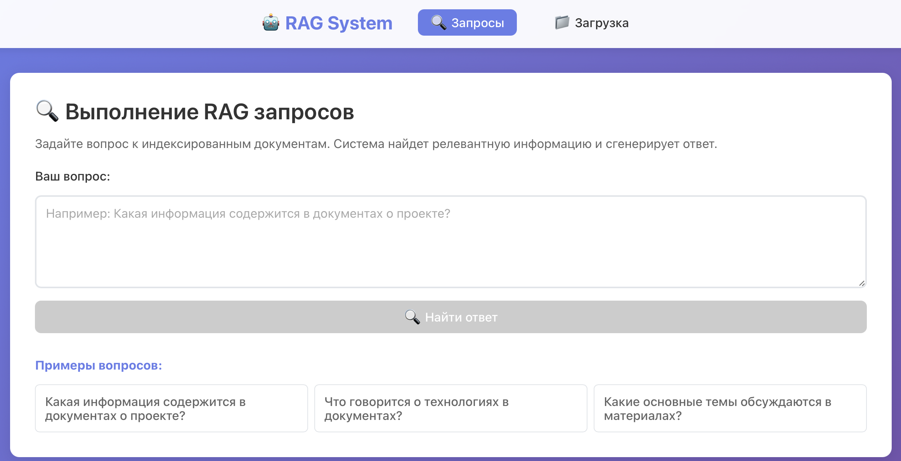

<h1 align="center">Q&A сервис с использованием RAG </h1>
<div align="center" style="margin: 20px 0;">
  
  
  
  
  
  
</img>
  
  
  
  
</div>

<br>

Q&A сервис на основе RAG архитектуры, с использованием OCR.

*Система находится на стадии разработки

Основной функционал:

* Пользователь пишет текстовый запрос.

* Система находит наиболее релевантные фрагменты информации из предоставленного набора документов (knowledge base).

* Пользователь может загружать или дополнять в базу данных файлы различных форматов, используя `OCR`.

* Есть возможность добавления временного индекса.

* С помощью `LLM` генерируется полный, информативный ответ на основе найденных фрагментов.

* Наиболее частые запросы кэшируются в `Redis`.

* Система реализована как набор взаимодействующих микросервисов/компонентов, готовых к контейнеризации и развертыванию.

* Используется React - удобный веб-интерфейс для взаимодействия.

* **Десктопное приложение** - запускайте как нативное приложение с помощью Tauri.

* Имеется потенциал для горизонтального масштабирования.


В качестве примера спользуется датасет русских текстов [RuBQ_2.0](https://raw.githubusercontent.com/vladislavneon/RuBQ/refs/heads/master/RuBQ_2.0/RuBQ_2.0_paragraphs.json).

## Структура проекта

Весь Python-код находится в директории `app/`:

```
app/
├── api/            # FastAPI backend (эндпоинты, роутинг)
├── shared/         # Общие модули (логирование, конфиг, FAISS, OCR, загрузчик данных)
├── indexing/       # Сервис индексирования документов
├── query/          # Сервис запросов (поиск, LLM, пайплайн, Redis)
├── services/       # Микросервисная архитектура (отдельные сервисы + gateway)
├── run_api.py      # Точка входа API-сервера
├── run_redis.py    # Запуск Redis
└── logs.py         # Модуль логирования
react_frontend/     # React frontend
tests/              # Тесты
docker/             # Dockerfiles
```

## Архитектура веб-приложения




Система включает в себя два интерфейса:

### 1. React Frontend
Современный React интерфейс с расширенной функциональностью:
- Drag & Drop загрузка файлов
- Интуитивный интерфейс запросов
- Детальная настройка системы
- Современный дизайн с анимациями
- Адаптивная верстка для всех устройств
- **Десктопное приложение** - запуск как нативное приложение (Tauri)

**Запуск десктопного приложения (рекомендуется):**
```bash
./run_desktop.sh
```
Или вручную:
```bash
cd react_frontend
npm run tauri:dev
```

**Доступ в браузере:** http://localhost:3000

Подробнее: [react_frontend/DESKTOP_APP.md](react_frontend/DESKTOP_APP.md)

### 2. API Backend
FastAPI сервер с автоматической документацией:
- REST API для интеграции
- Интерактивная документация Swagger
- Встроенная валидация данных

**Доступ:** http://localhost:8000

**Документация:** http://localhost:8000/docs

# Краткое описание сервисов

**Сервис индексирования** -
принимает путь к данным для обработки, создает векторную БД (`FAISS`). Поддерживается инкрементальное обновление.
Используется `pytesseract` в качестве OCR.
Поддерживаемые форматы файлов - `pdf, jpg, png, txt`.

Пайплайн:
* Загрузка данных
* Проверка качества
* Очистка и нормализация
* Разбиение длинных текстов на чанки
* Векторизация
* Сохранение в векторную БД

**Сервис запросов** -
предоставляет API (`FastApi`) для приема запросов (`/query`) с использованием `LangChain`. В качестве LLM - `qwen/qwen3-4b-2507`, запущенная локально через LM Studio.

Пайплайн:
* Препроцессинг вопроса
* Поиск в кэше Redis
  * Возврат сгенерированного ответа
* Поиск ревелантных чанков в векторной БД
* Формирование промпта для LLM
* Запрос к LLM
  * Возврат сгенерированного ответа


# Схема взаимодействия компонентов


# Установка

1. Клонирование репозитория
```
git clone https://github.com/zolotykh907/RAG.git
cd RAG
```

2. Установка зависимостей

Проект использует [uv](https://docs.astral.sh/uv/) для управления зависимостями. Все зависимости описаны в `pyproject.toml`.

```bash
# Установка uv (если не установлен)
curl -LsSf https://astral.sh/uv/install.sh | sh

# Создание виртуального окружения и установка зависимостей
uv sync
```

**Frontend (Node.js):**
```
cd react_frontend
npm install
```

**Требования:**
- Python 3.10+
- Node.js 16+
- npm

# Запуск
Систему можно запустить локально, и с использованием `Docker`.

**Локально:**

Для начала нужно установить LM Studio для запуска модели локально:

Подробная инструкция по настройке LM Studio: см. [LM_STUDIO_SETUP.md](LM_STUDIO_SETUP.md)

Краткая версия:
1. Скачайте и установите LM Studio с официального сайта: https://lmstudio.ai/
2. Откройте LM Studio и скачайте модель `qwen/qwen3-4b-2507` (или любую другую модель Qwen)
3. Запустите локальный сервер в LM Studio:
   - Перейдите на вкладку "Local Server" (Локальный сервер)
   - Выберите загруженную модель `qwen/qwen3-4b-2507`
   - Нажмите "Start Server" (Запустить сервер)
   - Убедитесь, что сервер работает на порту 1234 (по умолчанию)
4. Не закрывайте LM Studio, пока работаете с системой

### Варианты запуска:

**1. React + API:**
```
# Запуск API
uv run rag-api

# В другом терминале запуск React frontend
python run_frontend.py
```

**2. Отдельные компоненты:**
```
# Только индексация
uv run python -m app.indexing.run_indexing

# Только API
uv run uvicorn app.api.main:app --reload --host 0.0.0.0 --port 8000

# Только React frontend
cd react_frontend && npm start
# Или
python run_frontend.py
```

**С использованием Docker**

**ВАЖНО:** Docker-контейнер будет подключаться к вашему локальному LM Studio серверу. Убедитесь, что:
1. LM Studio запущен и сервер активен на порту 1234
2. Модель `qwen/qwen3-4b-2507` загружена и выбрана в LM Studio

```
docker-compose up --build
```

После запуска вы сможете обратиться к:

**React Frontend:** http://localhost:3000

**API Backend:**
- http://localhost:8000/query - для запроса
- http://localhost:8000/upload-files - для загрузки и индексирования файлов

**API документация:** http://localhost:8000/docs

**CLI клиент:** `python client.py` (Консольный интерфейс для тестирования)

# Использованные технологии

## LLM - `qwen/qwen3-4b-2507`
Qwen 3 - это мощная языковая модель от Alibaba Cloud, которая хорошо работает с несколькими языками, включая русский. Версия с 4B параметров обеспечивает отличный баланс между качеством ответов и производительностью на обычном железе. Модель запускается локально через LM Studio, который предоставляет удобный интерфейс управления и OpenAI-совместимый API. Модель абсолютно бесплатна и может использоваться в коммерческих целях.

## Модель для эмбеддингов - `sentence-transformers/paraphrase-multilingual-MiniLM-L12-v2`
Эффективно работает с множеством языков, в том числе русским.
Имеет небольшой размер (~500мб), при хорошем качестве работы.

## Векторная БД - `FAISS`
Оптимизирована для быстрого поиска похожих векторов разными способами, легко развернуть локально.
Работает с большими наборами данных.

## Фреймворк для работы с LLM - `LangChain`
Поддерживает универсальный интерфейс для работы с разными LLM, стандартизированные промты. Так же есть отличная система интеграции с внешними инструментами.

## Frontend - `React + CSS3`
Современный веб-интерфейс с интуитивным дизайном:
- **React 18** - Основной фреймворк для UI
- **CSS3** - Современные стили с градиентами и анимациями
- **React Router** - Навигация между страницами
- **Адаптивный дизайн** - Работает на всех устройствах

## Общие преимущества
* Полностью локальное бесплатное решение, которое не зависит внешних ресурсов (облачных моделей и т.д.)

* Есть возможность простой настройки через конфигурационные файлы

* Поддерживается русский язык

* Простое развертывание разными способами

* Есть возможность масштабирования

* **Современный веб-интерфейс**

# Возможности React Frontend

## Загрузка файлов
- **Drag & Drop интерфейс** - удобная загрузка файлов
- **Поддержка форматов** - PDF, DOC, DOCX, TXT, JPG, PNG
- **Информация о файлах** - размер, тип, название
- **Валидация** - проверка форматов и размера
- **Временный индекс** - возможность загрузить временный файл для индексирования, без сохранения на диск

## Выполнение запросов
- **Интуитивный интерфейс** - простые формы для вопросов
- **Источники** - показ использованных документов
- **Обработка ошибок** - понятные сообщения
- **История запросов** - сохранение запросов
- **Настройка сервисов** - удобная настройка параметров каждого сервиса

## Дизайн и UX
- **Адаптивная верстка** - работает на всех устройствах
- **Состояния загрузки** - спиннеры и индикаторы
- **Русский интерфейс** - полностью на русском языке


# Описание API эндпоинта

## /query
Предоставляет сгенерированный ответ на основе поиска и и ответа модели

**Формат запроса:**
```
{
  "question": "..."
}
```

**Формат ответа:**
```
{
  "answer": "...",
  "texts": [
    {
      ...
    },
    ...
  ]
}
```

# Анализ и проверка данных тестового датасета

**Датасет [RuBQ_2.0](https://raw.githubusercontent.com/vladislavneon/RuBQ/refs/heads/master/RuBQ_2.0/RuBQ_2.0_paragraphs.json):**

Всего текстов: `56952`

Средняя длина текста: `449` символов

Мин. длина текста: `1` символов

Макс. длина текста: `11010` символов

**После проверки качества получили следующие значения:**

Пустых документов: `0`

Дубликатов по UID: `0`

Дубликатов по хэшу текстов: `179`, тексты сравнивались по хешу `SHA-256`

Коротких текстов (len<10): `93`

Кол-во текстов после очистки: `56719`


# Тесты и их запуск
Реализовано покрытие unit-тестами ключевых компонентов:

## test_data_quality (функции препроцессинга текста):
Тестируются:
1. Нормализация текста:
* Приведение к нижнему регистру
* Удаление пунктуации и лишних пробелов
* Лемматизация слов

2. Вычисление хеша текста:
* Консистентность для одинаковых текстов с разным форматированием
* Уникальность хешей для разных текстов

3. Проверка качества данных:
* Выявление пустых документов
* Поиск дубликатов текстов
* Обнаружение слишком коротких текстов


## test_create_prompt (логика формирования промпта на основе вопроса и релевантных чанков):
Тестируются:
1. Формирование промпта:
* Корректная подстановка вопроса и контекста
* Соответствие заданному шаблону
2. Вызов LLM:
* Передача правильно сформированного запроса
* Обработка возвращаемого значения
3. Формат ответа:
* Проверка типа возвращаемых данных
* Валидация содержимого ответа

Используется MagicMock для изоляции теста от реальной LLM

DummyConfig содержит тестовый шаблон промпта

## test_integration (интеграционный тест, проверяющий работу всего пайплайна Q&A после запуска `docker-compose up` (отправка тестового вопроса через API и проверка наличия ответа)).
Тестируется:
1. Доступность API эндпоинта /query
2. Корректность обработки POST-запроса с вопросом
3. Структура и содержание возвращаемого ответа

Проверяет работу всей системы после запуска контейнера.

**Запуск всех тестов**:
```
uv run pytest tests/
```

# Возможные улучшения и масштабирование
1. Улучшение поиска и создания эмбеддингов
* Использование более мощных моделей или моделей, специально обученных на русский язык

2. Улучшение LLM
* Использование более мощных локальных моделей или дообучение на собственных данных
* Доп. обраобтка наиболее часто задаваемых вопросов

3. Оптимизация
* Квантование моделей
* Оптимизация под GPU/TPU
* Разделение запросов на батчи

4. Добавление сторонних инструментов и расширение функционала
* Создание ИИ-Агента, например с помощью LangChain

5. Масштабирование
* Запуск нескольких реплик сервиса за балансировщиком нагрузки

# Контакты

<div align="center">
  
  
</div>
